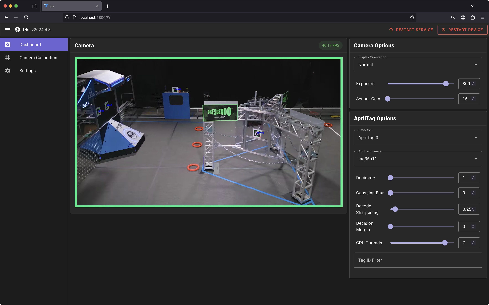
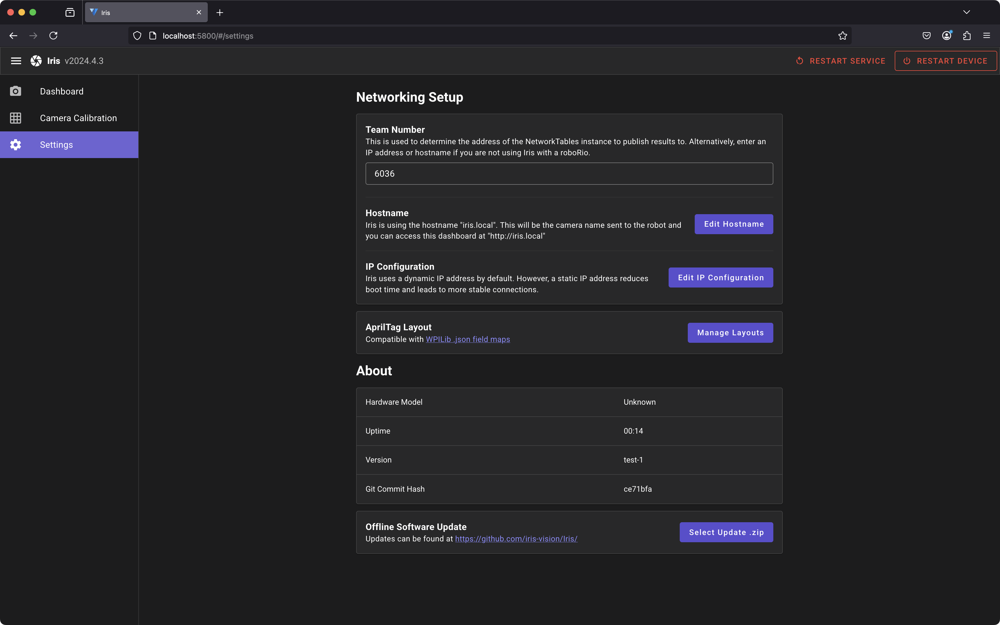
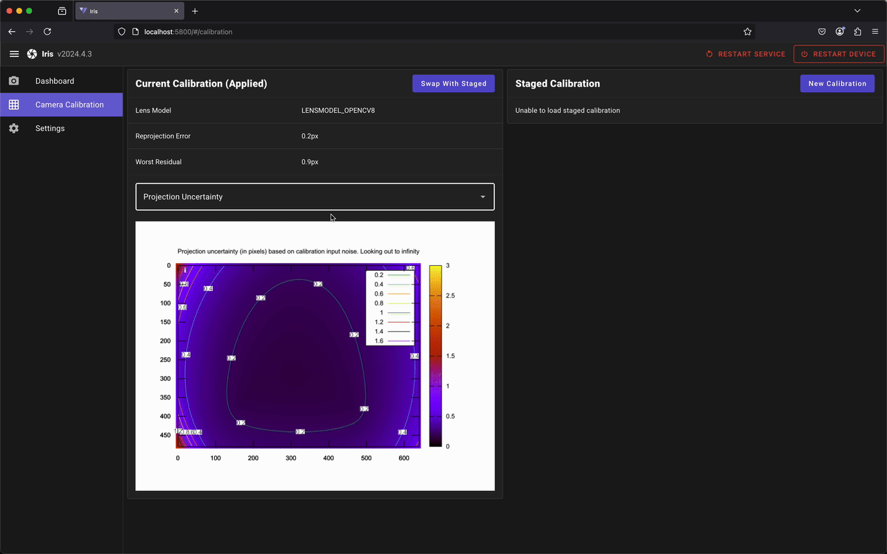

<div>
  <h1 align="center">Iris</h1>
  <p align="center">
    High-performance AprilTag vision for FRC
  </p>
</div>



## Features

### FRC Compatibility

Designed for FRC integration, Iris uses the [WPILib .json field format](https://github.com/wpilibsuite/allwpilib/tree/main/apriltag/src/main/native/resources/edu/wpi/first/apriltag), ensuring day one support as soon as the field layout is published on kickoff. 

All detection and estimation results are encoded into WPIStructs and published to NetworkTables under `/iris/<camera_name>`. A [Java vendordep](https://github.com/iris-vision/vendordep) is provided for interfacing with robot code. 

### Apriltag detection

The following algorithms are supported for AprilTag detection: 
- AprilTag3 ([fork of pyapriltags](https://github.com/iris-vision/pyapriltags) updated to version 3.4.3)
- ArUco

### Pose estimation

Iris uses Perspective-n-Point (PnP) pose computation to estimate field-relative camera positioning. Individual AprilTag transforms are also published, allowing the implementation of localized localization strategies when needed.

The pipeline incorporates a random sample consensus (RANSAC) algorithm that effectively filters outlier pose estimates, significantly improving multi-tag pose stability. 

Specific AprilTag IDs can also be configured to be ignored, particularly useful for targets with poor lighting conditions or incorrect placement. 

### Logging

Match data is logged using the [MCAP](https://mcap.dev/) file format, enabling post-match analysis. Log files are numbered sequentially to avoid filename conflicts due to the system clock resetting. The system encodes processing data with Protocol Buffers and compresses camera frames as JPEGs for efficient storage. A fps limit is applied while the robot is disabled to conserve storage. 

Log files can be viewed with [Foxglove Studio](https://foxglove.dev/):


[Match replay demo with 4 cameras](https://youtu.be/B5HMl80a5v4)

### Web interface

Iris includes a comprehensive web dashboard for real-time monitoring and tuning. This interface provides live camera streaming alongside configurable camera and detection parameters.



### Offline Operation

Iris is designed for reliable offline operation with simple deployment commands:

```sh
just package # creates an offline-installable bundle
just deploy <ip address> # update development devices
```

### Camera calibration

Iris integrates [mrcal](https://mrcal.secretsauce.net/) as its calibration backend. The system automatically processes calibration data and presents visualizations for easy verification and analysis. 



## Acknowledgements
- [WPILib](https://github.com/wpilibsuite/allwpilib)
- [Northstar](https://github.com/Mechanical-Advantage/AdvantageKit/tree/ns-dev/akit/py/northstar)
- [Photonvision](https://github.com/PhotonVision/photonvision)
